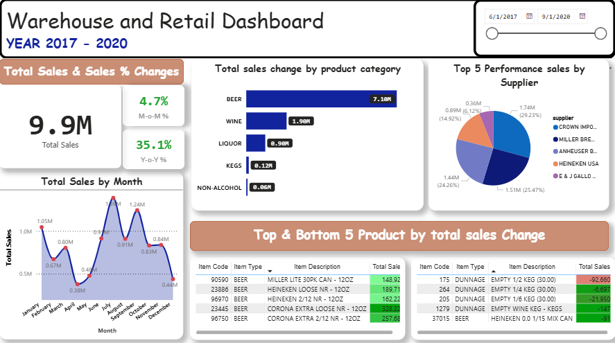
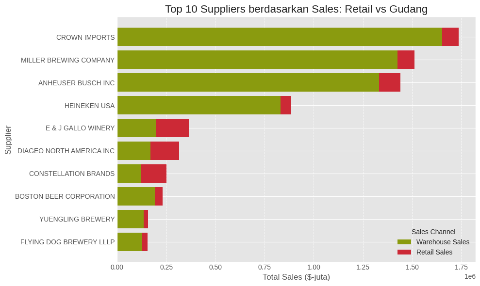
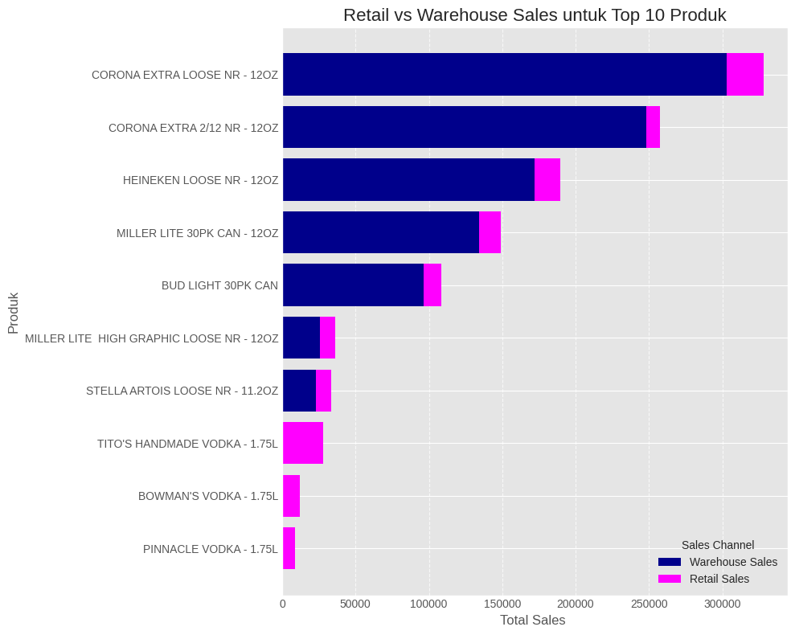
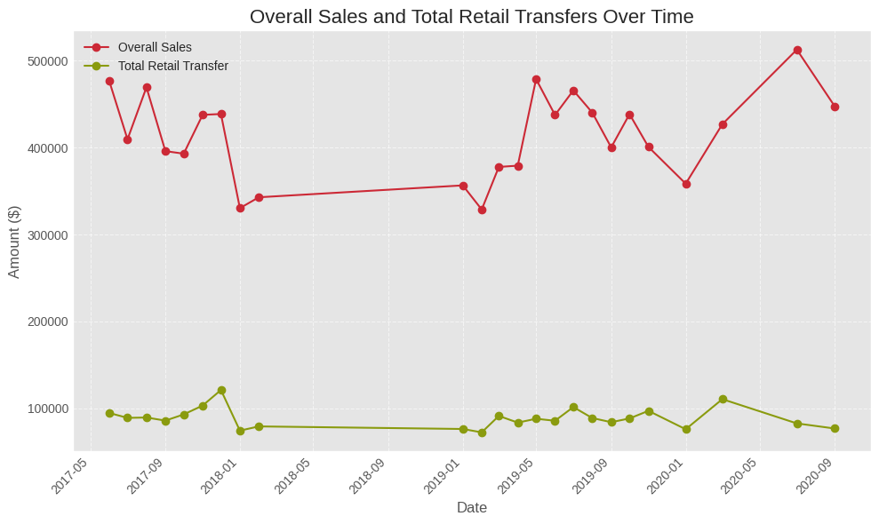
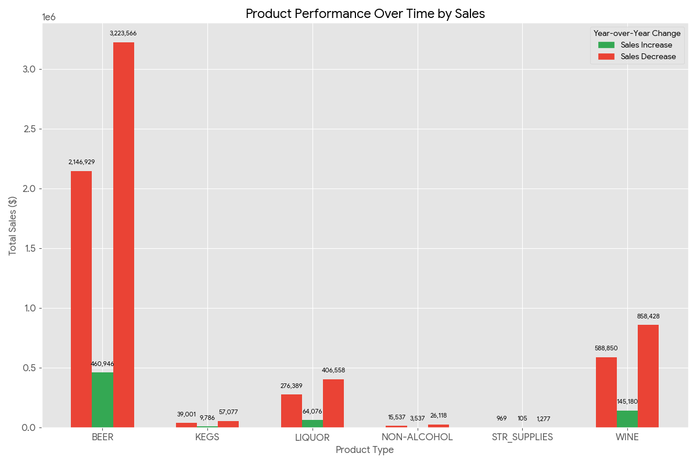
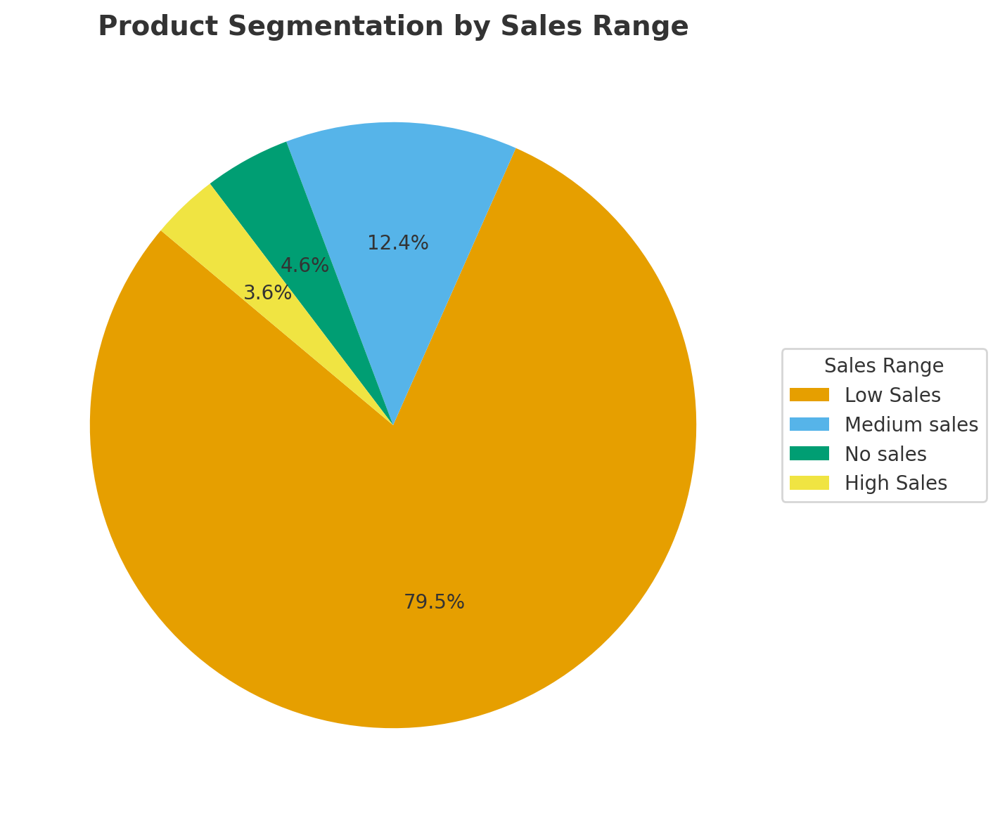
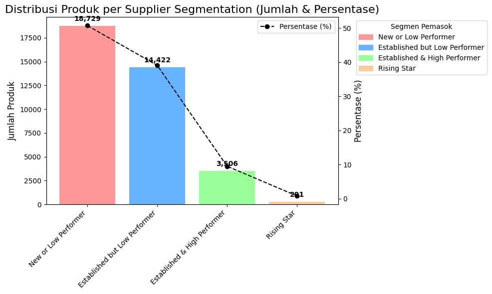

# 🧭 Warehouse anda Retail Sales Transfer (Exploratory Data Analysis) rentang data 2017 - 2020

Projek ini saya kerjakan untuk mengeksplorasi datasen warehouse retail sales yang berasal dari [Warehouse retail sales](https://catalog.data.gov/dataset/?q=warehouse+and+retail+sales&sort=views_recent+desc&ext_location=&ext_bbox=&ext_prev_extent=). Dataset ini berisi produk-produk minuman keras seperti beer, wine dan yg lainnya, dataset ini mencakup data yg dimulai dari tahun 2017 sama 2020 informasi yang tersedia mencakup detail :
(year,month,supplier,item_code,item_description,item_type,retail_sales,retail_transfers dan warehouse_sales).

### Dalam data ini terdapat:

    - 9.9 M dari total penjualan (retail sales dan warehouse sales)
    - 2.7 M dari Total Retail Transfers (retail transfers)
    - 34 K untuk keseluruhan total produk yang terdapat pada dataset ini.

# 📌 Latar belakang

Proyek ini saya kerjakan sebagai proses pembelajaran data analytics. Dengan melakukan analisis pada dataset ini, saya berharap dapat meningkatkan kemampuan analisis saya, khususnya dalam konteks business analyst, untuk menyelesaikan permasalahan bisnis yang dihadapi serta memanfaatkan berbagai dataset yang berjenis business dataset. Proyek ini juga bertujuan mempelajari teknik visualisasi data untuk menggambarkan insight yang relevan secara tepat, serta membuat laporan dan presentasi yang mencakup permasalahan bisnis dan bagaimana cara menyelesaikannya.

### Temukan visualisasi dan query SQL di bawah ini:

- Power BI ? [Overview](assets)
- SQL Query ? [Query](Scripts)

# Berikut ini beberapa pertanyaan yang ingin saya jawab melalui query SQL:

    1. Siapa 10 supplier strategis yang memiliki kontribusi penjualan paling signifikan, baik retail sales maupun warehouse sales ?
    2. Tipe dan produk apa yang memiliki kinerja penjualan optimal ?
    3. Apakah peningkatan transfer produk dari gudang ke toko retail berkorelasi positif dengan kenaikan total penjualan ?
    4. Apakah ada jenis produk tertentu yang secara konsisten memiliki kinerja diatas rata-rata tahunan (menunjukan tren peningkatan penjualan dari tahun ke tahun) ?
    5. Bagaimana distribusi produk berdasarkan tingkat penjualan, dan berapa banyak produk(persentase) yang termasuk dalam kategori high, medium dan low atau tidak ada penjualan ?
    6. Mengelompokkan supplier yang menjual produk berdasarkan seberapa baik penjualannya dan berapa lama supplier produk itu sudah ada di pasar, sehingga memudahkan kita untuk menilai kinerja masing-masing Supplier?

# 🛠 Tools yang saya gunakan

    - SQL: Saya gunakan untul melakukan data cleansing, removing duplicate, data wrangling, standarisasi data, data validation juga untuk melakukan analysis lanjutan.
    - PostgreSQL: Ini merupakan RDBMS yang ideal untuk handling dan melakukan analysis mendalam.
    - Visual Studio Code dan dBeaver: ini saya gunakan sejauh ini untuk melakukan manajemen database dan menjalankan query SQL.
    - PowerBI: Saya gunakan untuk membuat dashboard untuk menampilkan temuan yang saya dapatkan.
    - Git/Github: ini merupakan version control dan saya gunakan untuk sharing sql scripts project data analyst yang saya lakukan.

# 🚦 Analysis Result

Dari keseluruhan query untuk projek ini digunakan untuk investigasi aspek yang spesific dalam melakukan analisis data untuk Warehouse and retail sales dataset. Berikut bagaimana saya menjawab setiap pertanyaan :

### 1. Siapa 10 supplier strategis yang memiliki kontribusi penjualan paling signifikan, baik retail sales maupun warehouse sales ?

- Mencari 10 supplier yang strategis dalam kontribusi penjualan yg paling signifikan
  [query](Scripts/1_kpi_metrix.sql)

## Supplier Sales Performance

| Supplier                 | Retail Sales ($) | Warehouse Sales ($) | Overall Sales ($) | Retail Transfers ($) | % Retail Sales |
| ------------------------ | ---------------: | ------------------: | ----------------: | -------------------: | -------------: |
| CROWN IMPORTS            |           84,438 |           1,651,872 |         1,736,309 |               82,833 |          4.86% |
| MILLER BREWING COMPANY   |           87,156 |           1,425,429 |         1,512,585 |               85,224 |          5.76% |
| ANHEUSER BUSCH INC       |          109,961 |           1,331,171 |         1,441,132 |              108,231 |          7.63% |
| HEINEKEN USA             |           56,140 |             829,796 |           885,936 |               54,860 |          6.34% |
| E & J GALLO WINERY       |          166,171 |             197,464 |           363,634 |              165,022 |         45.70% |
| DIAGEO NORTH AMERICA INC |          145,343 |             170,565 |           315,908 |              144,014 |         46.01% |
| CONSTELLATION BRANDS     |          131,665 |             119,400 |           251,064 |              129,762 |         52.44% |
| BOSTON BEER CORPORATION  |           40,129 |             191,593 |           231,722 |               40,103 |         17.32% |
| YUENGLING BREWERY        |           23,028 |             134,148 |           157,176 |               22,402 |         14.65% |
| FLYING DOG BREWERY LLLP  |           26,359 |             128,292 |           154,651 |               26,001 |         17.04% |

### Insight dan business solution yg dapat saya berikan:

1. Crown Imports dan Miller Browning Company menguasai penjualan dengan kontribusi terbesar dari warehouse sales ($1,65 dan $1,43), sedangkan penjualan retail hanya sebagian kecil.

   - Solusi: Fokus kerja sama dengan kedua supplier ini untuk memastikan pasokan gudang yang stabil melalui peningkatan komunikasi, negosiasi harga, dan optimasi logistik untuk pesanan besar.

2. E&J Gallo Winery dan Constellation Brands memiliki penjualan retail yang tinggi (45,70% dan 52,44%), menunjukkan produk mereka populer di toko retail.
   - Solusi: Kerja sama dengan supplier ini untuk efisiensi rantai pasok toko, manajemen inventaris, optimasi transfer produk retail, dan promosi khusus produk mereka.

### 2. Tipe dan produk apa yang memiliki kinerja penjualan optimal ?

## Top 10 Produk by Retail sales vs Warehouse Sales

| Item Description                         | Item Type | Total Retail Sales | Avg Retail Sales | % Retail vs Total | Total Warehouse Sales | Avg Warehouse Sales | % Warehouse vs Total |
| ---------------------------------------- | --------- | -----------------: | ---------------: | ----------------: | --------------------: | ------------------: | -------------------: |
| TITO'S HANDMADE VODKA - 1.75L            | LIQUOR    |             27,581 |            1,149 |            98.26% |                   487 |                  20 |                1.74% |
| CORONA EXTRA LOOSE NR - 12OZ             | BEER      |             25,064 |            1,044 |             7.64% |               303,161 |              12,632 |               92.36% |
| HEINEKEN LOOSE NR - 12OZ                 | BEER      |             17,761 |              740 |             9.36% |               171,950 |               7,165 |               90.64% |
| MILLER LITE 30PK CAN - 12OZ              | BEER      |             14,440 |              602 |             9.70% |               134,486 |               5,604 |               90.30% |
| BUD LIGHT 30PK CAN                       | BEER      |             12,299 |              512 |            11.32% |                96,317 |               4,013 |               88.68% |
| BOWMAN'S VODKA - 1.75L                   | LIQUOR    |             12,127 |              505 |            98.67% |                   164 |                   7 |                1.33% |
| MILLER LITE HIGH GRAPHIC LOOSE NR - 12OZ | BEER      |             10,374 |              432 |            28.81% |                25,632 |               1,068 |               71.19% |
| STELLA ARTOIS LOOSE NR - 11.2OZ          | BEER      |             10,354 |              431 |            31.15% |                22,890 |                 954 |               68.85% |
| CORONA EXTRA 2/12 NR - 12OZ              | BEER      |              9,755 |              406 |             3.79% |               247,924 |              10,330 |               96.21% |
| PINNACLE VODKA - 1.75L                   | LIQUOR    |              8,676 |              362 |            99.15% |                    74 |                   3 |                0.85% |

### Insight dan business solution yg dapat saya berikan:

1. Produk-produk liquor (sperti vodka) hampir semuanya dijual melalui retail, sementara produk beer (bir) sebagian besar terjual melalui warehouse dalam jumlah besar.
   - Solusi: Stratego pengelolan inventaris yang berbeda. Untuk Liquor, fokus pada manajemen stok toko yang efesien. Untuk bir, dapat dioptimalkan dalam hal logistik gudang untuk memastikan ketersediaan pesanan.
2. Tito's Handmade Vodak merupakan produk teratas dalam penjualan ritel,sementara Corona extra loose dan Heineken Loose NR mendominasi penjualan gudang.
   - Solusi: Toko dapat mem-prioritaskan produk-produk ini dalam strategi penjualan. Lakukan promosi pada produk Vodka di toko-toko retail guna meningkatkan visibilitas, dan pastikan produk beer selalu tersedia di gudang untuk memenuhi permintaan toko.
3. Pola penjualan yang berbeda untuk setiap jenis produk menujukan supply chain yang harus disesuaikan.
   - Solusi: Buat planning untuk memaksimalkan supply chain untuk setiap kategori produk. Kita dapat gunakan data ini untuk memprediksi permintaan, dan memastikan produk yang tepat dan berada pada waktu yang tepat.

### 3. Apakah peningkatan transfer produk dari gudang ke toko retail berkorelasi positif dengan kenaikan total penjualan ?

## [Temukan Query Disini !!](Scripts/1_kpi_metrix.sql)

### Insight dan business solution yg dapat saya berikan:

1. Overall sales dan transfer produk ke toko ritel menunjukkan tren naik yang serupa seiring waktu, ini menegaskan bahwa peningkatan transfer produk mendorong kenaikan penjualan.
   - Solusi: Hal ini dapat dipertahankan dan dioptimalkan pada strategi transfer dari gudang ke toko dan memperkuat logistik untuk memastikan stok yang tersedia di toko di waktu yang tepat.
2. Terdapat lonjakan penjualan dan transfer di akhir tahun, menunjukkan adanya pola musiman.
   - Solusi: Strategi inventaris(penyimpan) dapat dipikirkan lebih awal dan alokasikan lebih banyak sumber daya logistik untuk mengantisipasi lonjakan permintaan dibulan-bulan yang mengalami spike.
3. Ada perbedaan antara total penjualan ritel dan jumlah transfer ritel.
   - Solusi: Kita dapat melakukan analisis mendalam guna identifikasi penyebabnya, seperti penjualan dari stok awal toko, produk yang langsung dikirim oleh supplier atau potensi data yg tidak akurat. Ini dapat dipertimbangkan untuk meningkatkan akurasi manajemen inventaris.

### 4. Apakah ada jenis produk tertentu yang secara konsisten memiliki kinerja diatas rata-rata tahunan (menunjukan tren peningkatan penjualan dari tahun ke tahun) ?

[Temukan query disini](Scripts/2_advance_analytics.sql)

### Insight dan business solution yg dapat saya berikan:

1. Penjualan **Beer** secara konsisten mendominasi diantara semua jenis produk, meski mengalami penurunan untuk tahun 2019. Penjualan **Liquor** dan **Kegs** berada di jauh Beer.
   - Solusi: Perusahaan dapat memfokuskan strategi pada produk beer sebagai pendukung utama pendapatan. Kita dapa menganalisa terhadap penyebab penurunan di tahun 2019 untuk mencegahnya berulang di tahun-tahun mendatang.
2. Bir, liquoer maupun kegs mengalami naik-turun (fluktuasi) penjualan tahunan yang signifikan, dengan tren naik dan turun yang tidak stabil dari tahun ke tahun.
   - Solusi: Kita dapat mengurangi fluktuasi ini, dengan mempertimbangkan promosi musiman, serta manajemen inventaris yang lebih fleksibel dan di versifikasi oleh portofolio produk untuk menyeimbangkan performa.

### 5. Bagaimana distribusi produk berdasarkan tingkat penjualan, dan berapa banyak produk(persentase) yang termasuk dalam kategori high, medium dan low atau tidak ada penjualan ?

[temukan query disini !!](Scripts/2_advance_analytics.sql)

### Insight dan business solution yg dapat saya berikan:

1. Mayoritas produk (79.34%) berada pada kategori **Low Sales**, dengan hanya 3.56% yang termasuk high sales. Ini mengindikasikan penjualn produk sangat bergantung hanya pada sebagian kecil produk.
   - Solusi: Justru, toko dapat berfokus pada investasi dan sumber daya untuk mendorong penjualan pada tingkat **Medium Sales** (12.57%) agar naik ke segmen **High Sales**.
2. Karena hanya sedikit produk yang mendominasi penjualan, perusahaan/toko sangat rentan jika salah satu produk unggulan performanya menurun.
   - Solusi: Lakukan diversifikasi produk secara hati-hati untuk menyebarkan resiko penjualan.
3. Terdapat persentase produk yang tidak terjual **No Sales** mencapai (4.52%). Ini harus di kurangi karena ini merupakan biaya pada penyimpanan yang tidak menghasilkan income/pendapatan.
   - Solusi: Retail maupun gudang dapat melakukan audit gudang/inventaris dengan berkala agar retail maupun gudang mengetahui produk yang tidak terjual. Kita dapat meningkatkan ini dengan melakukan promosi, return barang ke supplier untuk mengurangi biasa dan membebaskan ruang pada warehouse(gudang)

### 6. Mengelompokkan supplier yang menjual produk berdasarkan seberapa baik penjualannya dan berapa lama supplier produk itu sudah ada di pasar, sehingga memudahkan kita untuk menilai kinerja masing-masing Supplier?

[Temukan query disini!!](Scripts/3_categorize_sales.sql)

### Insight dan business solution yg dapat saya berikan:

1, Dominasi New/Low performer(50.7%) : Segmentasi ini memiliki banyak produk tapi berkontribusi rendah pada penjualan. - Solusi: Lakukan seleksi dan fokus pada supplier yang punya potensi dan eliminasi yang konsisten pada segment low/lemah 2. Established but low performer (39%): Segmentasi ini memiliki banyak supplier yang dapat bertahan terhadap penjualan tetapi juga kurang produktif. - Solusi: Supplier dapat meningkatkan kolaborasi melalui promo, optimisasi distribusi atau melakukan negosiasi ulang untuk kontrak agar performa naik dan membaik. 3. High Performer & Rising star (10.3%): Pada segementasi inti ini merupakan segmentasi yang berpotensi untuk tumbuh walaupun memiliki persentase terkecil. - Solusi: Perusahaan dapat memberikan insentif dan dukungan pemasaran untuk menjaga loyalitas sekaligus mempercepat pertumbuhan pada segemntasi supplier rising star.

# Conclusion (Kesimpulan)

1. Kontribusi Penjualan Didominasi Supplier & Produk Tertentu
   Hanya sebagian kecil supplier (Crown Imports, Miller Brewing, dll.) dan produk unggulan (Vodka, Corona, Heineken) yang menyumbang mayoritas penjualan. - Solusi: fokuskan strategi partnership & promosi pada top supplier dan produk kunci, sambil mendorong supplier/produk menengah agar naik kelas.
2. Supply Chain Perlu Diferensiasi & Optimalisasi
   Liquor cenderung kuat di retail, sedangkan beer dominan di warehouse; transfer produk terbukti mendorong kenaikan penjualan dengan pola musiman di akhir tahun. - Solusi: terapkan manajemen stok yang disesuaikan per kategori produk, siapkan strategi logistik musiman, dan pastikan transfer gudang–retail lebih efisien.
3. Risiko Konsentrasi Tinggi & Banyak Produk Low Performer
   Lebih dari 79% produk ada di kategori low sales, 4.5% bahkan tidak terjual, sementara hanya segelintir produk yang menopang revenue. - Solusi: lakukan diversifikasi portofolio, promosikan produk kategori medium agar naik kelas, dan kurangi produk no sales melalui audit & return ke supplier.
4. Supplier Segmentation Menunjukkan Potensi Pertumbuhan
   Mayoritas supplier masih tergolong New/Low Performer atau Established but Low Performer, hanya 10% yang High Performer/Rising Star. - Solusi: seleksi supplier rendah performa, dorong kolaborasi dengan supplier menengah, dan berikan insentif pada high performer & rising star untuk menjaga loyalitas.

# ❌ Closing Thought

Analisis ini menunjukkan bahwa kinerja penjualan sangat dipengaruhi oleh segelintir supplier dan produk utama, sementara mayoritas masih rendah kontribusinya. Dengan strategi supply chain yang tepat, diversifikasi portofolio, dan kolaborasi lebih erat dengan supplier, perusahaan dapat meminimalkan risiko, mengoptimalkan pertumbuhan, serta menjaga keberlanjutan bisnis jangka panjang.

# Technical Details

- Database: PostgreSQL
- Analysis Tools: PostgreSQL, VSCode, PGadmin
- Visualization: ChatGPT,Gemini and Power BI
